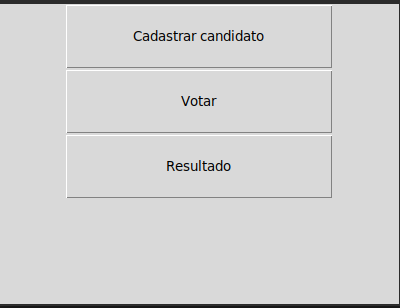
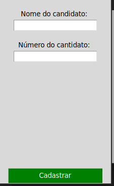
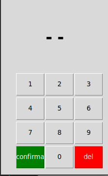
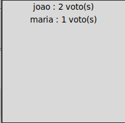

<h1 align="center">Urna eletrônica</h1>
<h2 align="center">Urna eletrônica feita em python</h2>
<i>(Exclusiva para presidente)</i>

 

<h3 align="center">Instalando os requisitos</h3>

 

Abra um <b>TERMINAL</b> ou <b>CMD</b> na pasta do projeto e digite: 

<pre>pip install -r req.txt</pre>

Isso irá fazer com que o <b>PIP</b> instale os pacotes necessários

 

<h3 align="center">Como usar: </h3>

 

<strong>Abrindo o Menu</strong>

Execute o arquivo <b>menu.py</b> para acessar as funcionalidades

 

Linux: 

<pre>python3 menu.py</pre>

Windows: 

<pre>python menu.py</pre>

A seguinte janela deve ser exibida:

 

<strong>Cadastrando candidatos</strong>

Ao clicar na primeira opção, a seguinte janela irá ser exibida: 

 

Ao cadastrar os candidatos desejados, feche a janela

 

<strong>Hora de votar !</strong>

Clicando na segunda opção, a seguinte janela irá ser exibida:

Digite o número do candidato desejado e aperta no botão '<b>confirma</b>'

Caso tenha errado o número, clique no botão '<b>del</b>'

Após todos votarem, feche a janela

 
<strong>Conferindo o resultado</strong>

Clicando na última opção deverá ser exibida uma janela contendo o nome dos candidatos e o número de votos

